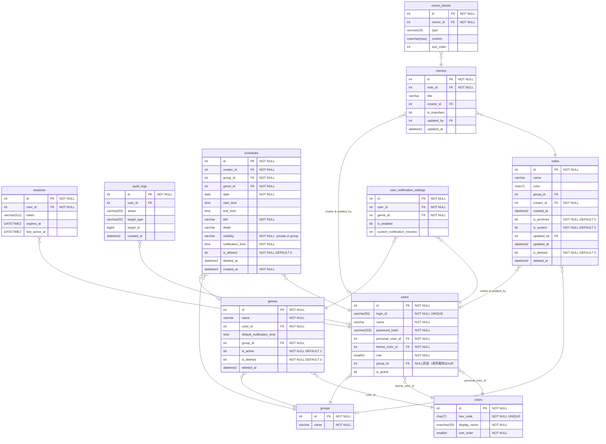

```mermaid

erDiagram
    colors {
        int id PK "NOT NULL"
        char(7) hex_code "NOT NULL UNIQUE"
        nvarchar(20) display_name "NOT NULL"
        smallint sort_order "NOT NULL"
    }

    users { 
        int id PK "NOT NULL"
        varchar(50) login_id "NOT NULL UNIQUE"
        varchar name "NOT NULL"
        varchar(255) password_hash "NOT NULL"
        int personal_color_id FK "NOT NULL"
        int theme_color_id FK "NOT NULL"
        smallInt role "NOT NULL"
        int group_id FK "NULL許容（未所属時はnull）"
        bit is_active
    }

    sessions {
        int id PK "NOT NULL"
        int user_id FK "NOT NULL"
        varchar(512) token
        DATETIME2 expires_at
        DATETIME2 last_active_at
    }

    audit_logs {
        int id PK "NOT NULL"
        int user_id FK
        varchar(50) action
        varchar(50) target_type
        bigint target_id
        datetime2 created_at
    }

    groups {
        int id PK "NOT NULL"
        varchar name "NOT NULL"
    }

    genres {
        int id PK "NOT NULL"
        varchar name "NOT NULL"
        int color_id FK "NOT NULL"
        time default_notification_time
        int group_id FK "NOT NULL"
        bit is_active "NOT NULL DEFAULT 1"
        bit is_deleted "NOT NULL DEFAULT 0"
        datetime2 deleted_at
    }

    schedules {
        int id PK "NOT NULL"
        int creator_id FK "NOT NULL"
        int group_id FK "NOT NULL"
        int genre_id FK "NOT NULL"
        date date "NOT NULL"
        time start_time
        time end_time
        varchar title "NOT NULL"
        varchar detail
        varchar visibility "NOT NULL: private or group"
        time notification_time "NOT NULL"
        bit is_deleted "NOT NULL DEFAULT 0"
        datetime2 deleted_at
        datetime2 created_at "NOT NULL"
    }

    notes {
        int id PK "NOT NULL"
        varchar name
        char(7) color
        int group_id FK
        int creator_id FK "NOT NULL"
        datetime2 created_at
        bit is_archived "NOT NULL DEFAULT 0"
        bit is_system "NOT NULL DEFAULT 0"
        int updated_by FK
        datetime2 updated_at
        bit is_deleted "NOT NULL DEFAULT 0"
        datetime2 deleted_at
    }

    memos {
        int id PK "NOT NULL"
        int note_id FK "NOT NULL"
        varchar title
        int creator_id FK
        bit is_important
        int updated_by FK
        datetime2 updated_at
    }

    memo_blocks {
        int id PK "NOT NULL"
        int memo_id FK "NOT NULL"
        varchar(20) type
        nvarchar(max) content
        int sort_order
    }

    user_notification_settings {
        int id PK "NOT NULL"
        int user_id FK "NOT NULL"
        int genre_id FK "NOT NULL"
        bit is_enabled
        int custom_notification_minutes
    }


    users o{--|| colors : "personal_color_id"
    users o{--|| colors : "theme_color_id"
    genres o{--|| colors : "color_id"

    users o{--|| groups : ""

    sessions o{--|| users : ""
    audit_logs o{--o| users : ""

    genres o{--|| groups : ""

    schedules o{--|| users : ""
    schedules o{--|| groups : ""
    schedules o|--o| genres : ""

    notes o{--o| groups : ""
    notes o{--o| users : "creator & updated_by"

    memos o{--|| notes : ""
    memos o{--o| users : "creator & updated_by"

    memo_blocks o{--|| memos : ""

    user_notification_settings o{--|| users : ""
    user_notification_settings o{--|| genres : ""


```