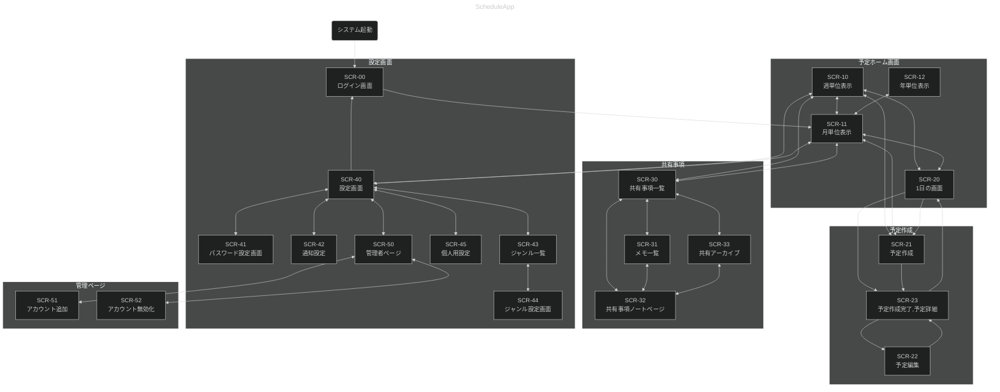

```mermaid

---
title: ScheduleApp
config:
    theme: dark
---

flowchart TD
    START(システム起動) --> SCR-00

    SCR-00[SCR-00\nログイン画面] --> SCR-11

subgraph 予定ホーム画面
    SCR-10[SCR-10\n週単位表示]
    SCR-10 <--> SCR-11
    SCR-10 <--> SCR-20

    SCR-11[SCR-11\n月単位表示]
    SCR-11 <--> SCR-20
    

    SCR-12[SCR-12\n年単位表示] 
    SCR-12 <--> SCR-11

    SCR-20[SCR-20\n1日の画面]
end
    SCR-10 <--> SCR-21
    SCR-10 <--> SCR-30
    SCR-10 <--> SCR-40
    SCR-11 <--> SCR-21
    SCR-11 <--> SCR-30
    SCR-11 <--> SCR-40
    SCR-20 --> SCR-21
    SCR-20 --> SCR-23


subgraph 予定作成
    SCR-21[SCR-21\n予定作成] --> SCR-23
    SCR-22[SCR-22\n予定編集] --> SCR-23
    SCR-23[SCR-23\n予定作成完了,予定詳細] --> SCR-20
    SCR-23 --> SCR-22
end

subgraph 共有事項
    SCR-30[SCR-30\n共有事項一覧]
    SCR-30 <--> SCR-31
    SCR-30 <--> SCR-32
    SCR-30 <--> SCR-33

    SCR-31[SCR-31\nメモ一覧]
    SCR-31 <--> SCR-32
    
    SCR-32[SCR-32\n共有事項ノートページ]

    SCR-33[SCR-33\n共有アーカイブ]
    SCR-33 <--> SCR-32
end

subgraph 設定画面
    SCR-40[SCR-40\n設定画面]
    SCR-40 <--> SCR-41
    SCR-40 <--> SCR-42
    SCR-40 <--> SCR-43
    SCR-40 <--> SCR-45
    SCR-40 <--> SCR-50
    SCR-40 --> SCR-00

    SCR-41[SCR-41\nパスワード設定画面]
    
    SCR-42[SCR-42\n通知設定]

    SCR-43[SCR-43\nジャンル一覧]
    SCR-43 <--> SCR-44

    SCR-44[SCR-44\nジャンル設定画面]
    SCR-45[SCR-45\n個人用設定]

end

subgraph 管理ページ
    SCR-50[SCR-50\n管理者ページ]
    SCR-50 <--> SCR-51
    SCR-50 <--> SCR-52

    SCR-51[SCR-51\nアカウント追加]

    SCR-52[SCR-52\nアカウント無効化]
end

```